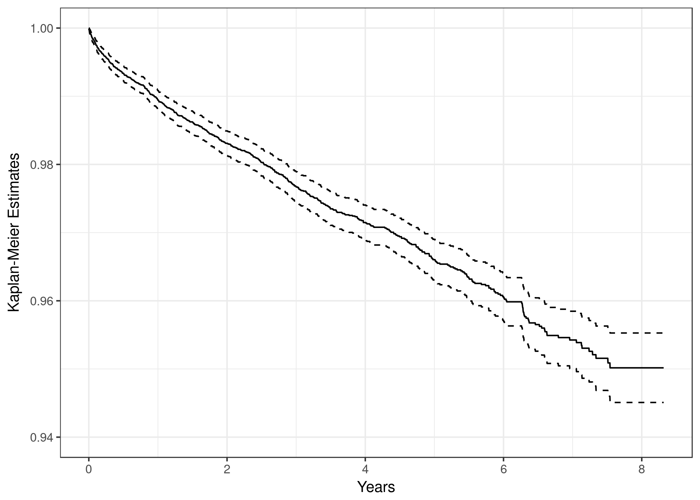
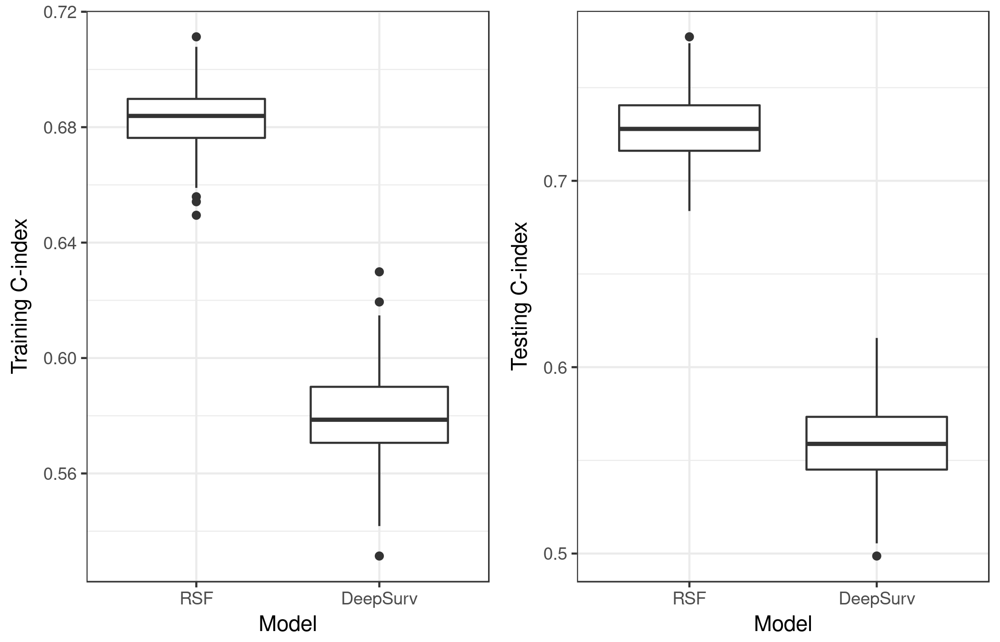

```{r setup, echo = FALSE, message = FALSE, warning = FALSE}
## some utility functions, see the source code for details
source("utils_template.R")

## external data can be read in by regular functions,
## such as read.table or load

## for latex and html output
isHtml <- knitr::is_html_output()
isLatex <- knitr::is_latex_output()
latex <- ifelse(isLatex, '\\LaTeX\\', 'LaTeX')

## specify global chunk options
knitr::opts_chunk$set(fig.width = 5, fig.height = 4, dpi = 300,
                      out.width = "90%", fig.align = "center")

```


# Introduction {#sec:intro}

For survival data, medical researchers' interests often lie in discovery of
significant treatment effects and important diagnosis covariates of patients.
The classical survival models, such as Cox proportional hazard model, assume
risk function in a simple linear form of covariates, which can be too
simplistic to capture the underlying relationship between response and
covariates.  In addition, they often require extensive efforts on variable
selection or prior medical information to model interaction between patients'
covariates and treatment covariates.  While nonlinear models, such as neural
networks and random forests, are able to model high-order interaction
terms. It is of interest to apply these machine learning methods to survival
data and compare their performance with classical statistical models. It would
be even more interesting to discover nonlinear relationship by machine
learning methods and build a statistical model for better interpretation and
capability for statistical inferences.


# Random Forests for Survival Data

Compared with linear models, tree models are able to incorporate complex
interaction between covariates more naturally.  @breiman1996ml proposed a
bootstrap aggregation method named Bagging that aggregates predictors based on
bootstrap samples to improve prediction accuracy or reduce the variance of an
estimated prediction function, which is an early example of ensemble methods.
@breiman2001ml proposed random forests (RF), an ensemble tree method that
introduces randomization to the base learning process. The randomness lies in
two folds: each tree is trained against a bootstrap sample; within each tree,
the candidate variables are randomly selected at each node, among which the
best split is found to maximize the difference of daughter nodes.  Compared
with Bagging, the additional randomness introduced to random forests results
in predictors that ensembles less correlated trees and is showed to further
improve prediction accuracy.  @ishwaran2008aoas extended RF method to random
survival forests (RSF) method for analysis of right-censored survival
data. The algorithm can be summarized as follows:

1. draw $B$ bootstrap samples from the origin data
2. grow a survival tree with randomly selecting $p$ candidate covariates at
   each node and maximizing survival difference between daughter nodes
3. each terminal node: no less than $d_0 > 0$ unique deaths
4. compute cumulative hazard function (CHF) by Nelson-Aalen estimator for each
   tree and average to obtain the ensemble CHF
5. compute prediction error using out-of-bag (OOB) data

The difference between original RF model and RSF model is mainly on the
splitting rules and the ensemble function.  @ishwaran2008aoas considered four
different splitting rules for RSF:

1. the log-rank splitting rule [@segal1988biometrics] that has been shown to
   be robust in both proportional and non-proportional hazard settings
   [@leblanc1993jasa];
2. the conservation-of-events splitting rule that splits nodes by finding
   daughters satisfying the conservation-of-events principle introduced in
   [@naftel1985misc], which asserts that the sum of the estimated CHF must
   equal the total number of deaths;
3. the log-rank score rule splitting nodes by a standardized log-rank
   statistic [@hothorn2003csda];
4. the random log-rank splitting rule using a random split with maximum
   log-rank statistic among the candidate variables for each node.

The random survival forests model does not assume proportional hazards and
thus may be more attractive than regular Cox Proportional hazard model
[@cox1972jrssb]. In addition, it naturally takes into account interaction
effects between covariates and providers insights on the importance of
covariates based on the tree structures. Variable selection can be performed
based on the variable importance (VIMP) measure. Similar to the regular RF,
the VIMP can be computed for RSF by conceptually dropping OOB samples down the
in-bag survival tree. The VIMP for variable $x$ is the prediction error for
the original ensemble subtracted from the prediction error for the new
ensemble obtained using randomizing $x$ assignments [@ishwaran2007rnews].
@ishwaran2010jasa further proposed an algorithm named "RSF-Variable Hunting"
for high-dimensional variable selection for survival data based on the idea of
minimal sub-tree [@ishwaran2007ejs].


# Deep Neural Networks for Survival Data

The regular Cox proportional hazards model has a linear relative risk function
$r(\boldsymbol{x},\boldsymbol{\beta})=\boldsymbol{\beta}^{\top}\boldsymbol{x}$.
In many applications, it is hard to assume a linear proportional hazards
condition and thus high-level interaction terms are required. However, as the
number of covariates and interactions increases, it becomes prohibitively
expensive.

@katzman2016arxiv proposed a Cox proportional hazards deep neural network
method called DeepSurv for personalized treatment recommendations.  DeepSurv is
a multi-layer perceptron that predicts a patient's risk of death.  The output
of the network is a single node estimating the relative risk function
$\hat{r}_{\theta}$ by the weights of the network $\theta$. The loss function
is set to be the negative log partial likelihood [@cox1975biometrika]. It
allows more than one layer and outputs a single node estimating the relative
risk function $\hat{r}_{\theta}$ by the weights of the network $\theta$.
Quite a few modern techniques are applied in the model fitting, such as weight
decay (L2-norm) regularization, Rectified Linear Units (ReLU) with batch
normalization [@ioffe2015icml], dropout [@srivastava2014jmlr], gradient
descent optimization algorithms including stochastic gradient descent and
adaptive moment estimation named Adam [@kingma2014arxiv], Nesterov momentum
[@nesterov2013mp], gradient clipping [@pascanu2012corr], learning rate
scheduling [@senior2013icassp], etc.


# Connecticut Suicide Death Data {#sec:suicide-data}

Suicide is a serious public health problem in the US.  Death by suicide is
increasing among all age groups in the US, with a 24\% increase in suicide
rates observed from 1999 to 2014.  There is a strong likelihood that suicide
attempters would make additional attempts after the initial suicide attempt
\citep{suominen2004ajp}, and suicide attempt is a strong predictor of suicidal
death \citep{bostwick2015}. The subjects in the suicide death data were
patients in the State of Connecticut who have been hospitalized for suicide
attempt or intentional self-injury during fiscal year 2005 to 2012 (from
October 1, 2004 to September 30, 2012).  Data from diagnosis were available
from the Connecticut Hospital Inpatient Discharge Data (HIDD). Deaths by
suicide were determined from the Office of the Connecticut Medical Examiner
(OCME). We are interested in the time since hospitalization due to suicide
attempts to suicidal death of those patients.  A total of 22,221 patients were
followed up until September 30, 2012.  Among them, 16,208 (73\%) were white
(9,108 female and 7,100 male) and 6,013 (27\%) were non-white (3,220 female
and 2,793 male). The number of event (suicidal death) was only 606 and thus
the censoring rate was about 97.3\%. The Kaplan-Meier survival curve is given
in Figure \@ref(fig:kmcurve).

(ref:kaplan-meier) The Kaplan-Meier survival curve of the CT suicide data with 95% confidence band.

```{r kmcurve, echo = FALSE, fig.cap = "(ref:kaplan-meier)"}

```


The HIDD data contained a large number of records on the characteristics of
patients and their previous hospital admissions. One of the research interest
was to identify important diagnostic categories associated with patient death.
The diagnostics were recorded as ICD-9 diagnosis codes, or more formally
ICD-9-CM (International Classification of Diseases, 9th Revision, Clinical
Modification). We grouped the ICD-9 codes by their three leading characters that
define the major diagnosis categories.  Suicide attempts were identified by both
ICD-9 external cause of injury codes and other ICD-9 code combinations
indicative of suicidal behavior \citep{patrick2010,chenAseltine2017}.  Other
ICD-9 codes during the inpatient hospitalization fell into 167 major diagnosis
categories, which led to 167 indicator variables.


## Results

We randomly split the 70% of suicide death data to a training set and the
remaining 30% to a test set 200 times. In each random split, we fitted the RSF
model and the DeepSurv model on the training set and measured the predicting
power of these two methods over the testing set through Harrell's c-statistic
[@harrell1996sim], an extension of the area under the receiver-operator
characteristics curve for censoring data. This statistic is an estimate of the
probability of concordance between the order of risk scores and survival
outcomes. For the RSF, the average c-statistic of the training set and test
set was 0.68 and 0.72, respectively. While for the DeepSurv model, the average
c-statistic of the training set and test set was 0.56 and 0.58, respectively.
A side-by-side boxplot of the training and testing c-statistic from 200 random
splits is given in Figure \@ref(fig:boxplot-c-index), from which we find that
RSF model provides a better prediction performance than the DeepSurv model on
the suicide dataset.

(ref:fig-boxplot) A side-by-side boxplot of the training and testing c-statistic from 200 random splits.

```{r boxplot-c-index, echo = FALSE, fig.cap = '(ref:fig-boxplot)'}

```

In addition, we performed variable selection from RSF model by the minimal
depth method [@ishwaran2010jasa]. For the training data from each random
split, we obtained the averaged number of maximal sub-trees (normalized by the
size of a tree) for each variable. Then we computed the sum of these average
numbers over all random splits. Length of stay, age, gender (male), and race
(white) are all among the top 30 variables having the largest sum. The top
ICD-9 diagnosis codes having the largest sum include
E84 (air and space transport accidents),
305 (nondependent abuse of drugs),
296 (episodic mood disorders),
969 (poisoning by psychotropic agents),
965 (poisoning by analgesics antipyretics and antirheumatics),
311 (depressive disorder, not elsewhere classified),
780 (general symptoms),
300 (anxiety, dissociative and somatoform disorders),
304 (drug dependence),
301 (personality disorders),
E85 (accidental poisoning by drugs, medicinal substances, and biologicals),
276 (disorders of fluid electrolyte and acid-base balance),
303 (alcohol dependence syndrome),
401 (essential hypertension),
309 (adjustment reaction),
881 (open wound of elbow forearm and wrist),
v62 (other psychosocial circumstances),
E98 (injury Undetermined Whether Accidentally Or Purposely Inflicted),
518 (other diseases of lung),
493 (asthma), and
292 (drug-induced mental disorders), etc.


# Summary and Discussion {#sec:summary}

In this course project, we applied random survival forests and deep neural
network model to the suicide death data and obtained some hands-on experience
of the "state-of-the-art" models. Compared with deep neural network model, RSF
is closer to the so-called "off-the-shelf" procedure for data mining since it
provides insights for variable selection and does not require heavy tuning on
the hyper-parameters.


Both methods are quite computationally intensive.  We applied parallel
computing on the data level for fitting the 200 random splits of the suicide
data.  Fitting RSF models with only 1,000 trees over 200 random splits using
six cores (Intel i7, up to 3.8 GHz) took about 30 hours, while Fitting
DeepSurv models with only two hidden layers using four cores took about 50
hours.  Due to the limitation of available computing resource, we did not
perform systematic tuning procedure, such as cross-validation and random
hyper-parameter optimization search [@bergstra2012jmlr] for hyper-parameters
in deep neural network model, which was the probably the reason why we did not
obtain comparable prediction performance from the DeepSurv model.


We also performed a simulation study for investigating the prediction
performance of the RSF model and the DeepSurv model over survival data with a
fraction of cure group.  However, the results are not included and not
discussed in this report.  All the source code is available at the project
repository on GitHub: https://github.com/statds/final-project-wenjie_wang.
The RSF model has an existing implementation in R and the DeepSurv model has
existing implementation in Python.  However, setting up a working and probably
reproducible computing environment for both models is not trivial.  Therefore,
we set up a Dockerfile and built a docker image for this project for providing
a readied and reproducible (hopefully) computing environment for people who
are interested in this project. The docker image is available at Docker Hub:
https://hub.docker.com/r/wenjie2wang/statds-spring2018/.


# Acknowledgment {-}

The author would like to thank Professor Jun Yan, Professor Elizabeth
Schifano, and Professor Kun Chen for providing this interesting and inspiring
course. All comments and suggestions received (from classmates) were/would be
also appreciated.


# Reference {-}
